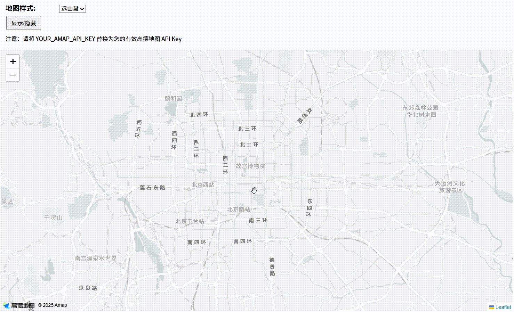

# Leaflet 高德地图图层插件开发历程

## 开发缘由

在我们的 GIS 项目中，地图功能基于 Leaflet 框架开发，已经积累了丰富的业务功能和交互逻辑。然而在实际应用中，我们遇到了一个普遍的痛点：

### 现有问题

1. **地图样式选择有限**：Leaflet 默认支持的地图服务（如 OpenStreetMap、天地图等）样式较为单一，难以满足现代化的 UI 设计需求。

2. **高德地图样式丰富**：高德地图提供了 11 种内置样式，从标准的"远山黛"到深色的"幻影黑"，再到清新的"草色青"，能够很好地适配不同的应用场景。

3. **自定义矢量样式**：高德地图支持完全自定义的矢量地图样式，可以根据品牌色彩和设计规范定制专属的地图样式。

4. **迁移成本高昂**：如果要从 Leaflet 完全迁移到高德地图 API，需要重写大量的业务逻辑和交互功能，这在成熟的项目中是不现实的。

### 解决方案

基于以上痛点，我们开发了 **leaflet-amap-layer** 插件，实现了一个优雅的解决方案：

- **保持 Leaflet 生态**：继续使用 Leaflet 的所有功能和 API
- **集成高德地图**：将高德地图作为 Leaflet 的一个图层进行渲染
- **零学习成本**：开发者无需学习新的 API，所有功能仍然通过 Leaflet 的接口操作

## 插件简介

`leaflet-amap-layer` 是一个轻量级的 Leaflet 插件，它通过以下技术实现了两个框架的完美融合：

1. **自定义图层机制**：利用 Leaflet 的 `L.CustomLayer` 创建了一个自定义图层
2. **坐标系统同步**：实时同步两个地图的坐标系和投影
3. **事件联动机制**：确保两个地图的操作和事件保持一致
4. **性能优化**：只在需要时更新地图状态，避免重复渲染

## 插件效果


## 安装使用

### 快速开始

#### 1. 安装依赖

```bash
# 安装插件
npm install leaflet-amap-layer

# 安装必需的依赖
npm install leaflet@^1.9.4 @amap/amap-jsapi-loader@^1.0.1
```

#### 2. 基础使用

```javascript
import L from 'leaflet';
import "leaflet/dist/leaflet.css";
import { createAmapLayer } from 'leaflet-amap-layer';

// 创建 Leaflet 地图
const map = L.map('map').setView([39.90960, 116.39722], 10);

// 创建高德地图图层
const amapLayer = createAmapLayer({
  apiKey: 'your-amap-api-key',
  securityConfig: {
    securityJsCode: 'your-security-js-code'
  },
  amapConfig: {
    mapStyle: 'whitesmoke' // 使用远山黛样式
  }
});

// 将图层添加到地图
amapLayer.addTo(map, [39.90960, 116.39722], 10);
```

#### 3. HTML 直接引用

```html
<!DOCTYPE html>
<html>
<head>
    <link rel="stylesheet" href="https://unpkg.com/leaflet@1.9.4/dist/leaflet.css">
</head>
<body>
    <div id="map" style="height: 600px;"></div>

    <script src="https://unpkg.com/leaflet@1.9.4/dist/leaflet.js"></script>
    <script src="https://unpkg.com/@amap/amap-jsapi-loader@1.0.1/dist/index.js"></script>
    <script src="https://unpkg.com/leaflet-amap-layer/dist/leaflet-amap-layer.umd.js"></script>

    <script>
        const map = L.map('map').setView([39.90960, 116.39722], 10);
        const amapLayer = new LeafletAmapLayer.AmapLayer({
            apiKey: 'your-amap-api-key',
            securityConfig: {
                securityJsCode: 'your-security-js-code'
            },
        });
        amapLayer.addTo(map, [39.90960, 116.39722], 10);
    </script>
</body>
</html>
```

### 高级功能

#### 样式切换

```javascript
// 动态切换地图样式
amapLayer.setMapStyle('dark');    // 幻影黑
amapLayer.setMapStyle('fresh');   // 草色青
amapLayer.setMapStyle('whitesmoke'); // 远山黛
```

#### 图层控制

```javascript
// 控制图层可见性
amapLayer.setVisible(false);

// 调整透明度
amapLayer.setOpacity(0.7);

// 设置层级
amapLayer.setZIndex(1000);
```

#### 获取原生实例

```javascript
// 获取高德地图原生实例
const amap = amapLayer.getAmapInstance();

// 使用高德地图原生 API
amap.addControl(new AMap.Scale());
amap.addControl(new AMap.ToolBar());
```

## 项目收益

通过使用这个插件，我们实现了：

1. **提升了用户体验**：地图样式更加美观和现代化
2. **降低了开发成本**：无需重写现有功能
3. **保持了技术栈统一**：继续使用熟悉的 Leaflet API
4. **扩展了样式选择**：支持高德地图的 11 种内置样式和自定义样式

## 开源分享

考虑到这个问题的普遍性，我们决定将这个解决方案开源，希望能够帮助到更多有类似需求的开发者。插件已经发布到 NPM，完全免费使用，欢迎社区贡献和反馈。

---

**项目地址**：https://github.com/giserlk360/leaflet-amap-layer

**NPM 包**：https://www.npmjs.com/package/leaflet-amap-layer

**在线文档**：https://github.com/giserlk360/leaflet-amap-layer/blob/main/README.zh.md